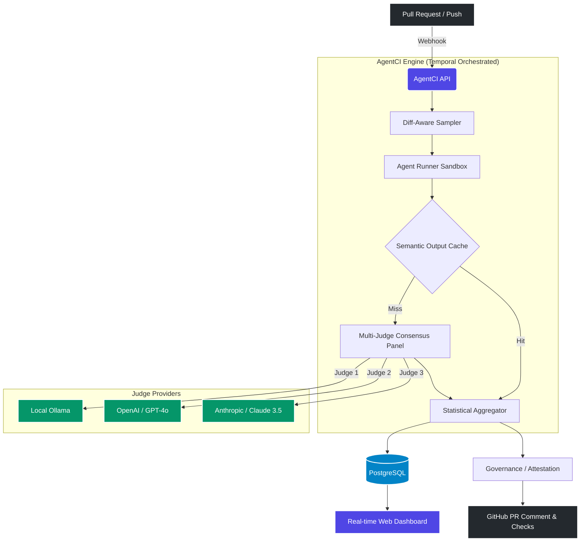
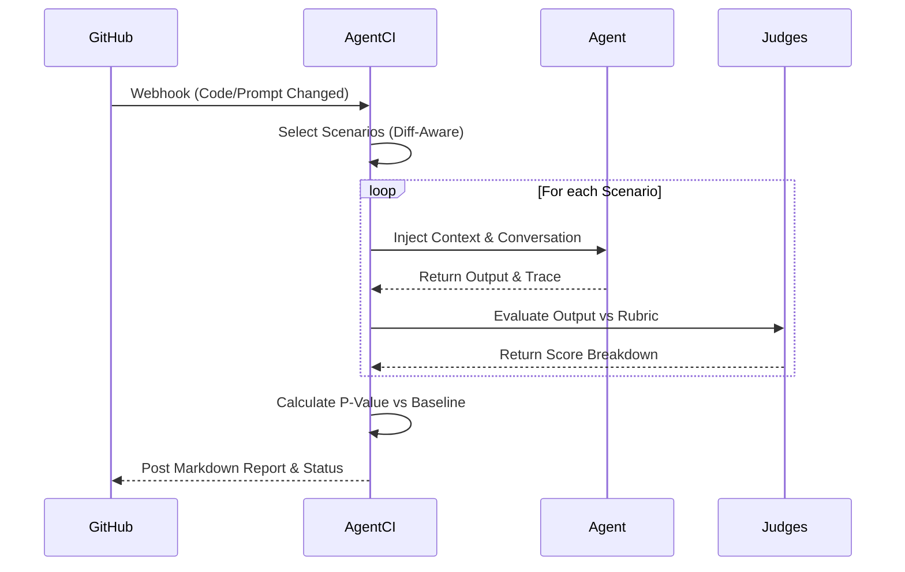

<div align="center">
  
  <h1>⚡ AgentCI</h1>
  <p><b>Enterprise-Grade CI/CD Quality Gate for LLM Agents</b></p>
  
  [](https://badge.fury.io/py/agentci)
  [](https://opensource.org/licenses/MIT)
  [](https://github.com/agentci/agentci/actions)
  [](https://github.com/astral-sh/ruff)
</div>

<br>

**AgentCI** is a continuous integration framework designed specifically for LLM-powered agents. It acts as an automated quality gate in your CI/CD pipeline, running multi-judge consensus panels against your agent's behavior to catch regressions, hallucinations, and safety violations *before* they reach production.

---

## 🌟 Why AgentCI?

Traditional CI/CD tools test code execution. AgentCI tests **behavioral outcomes**. 

When you change a system prompt, update a RAG pipeline, or switch underlying models, standard unit tests cannot reliably tell you if the agent's tone became aggressive or if it started hallucinating APIs. AgentCI solves this using LLM-as-a-Judge panels with statistical rigor.

### Key Capabilities

*   🛡️ **Zero-Cost Local Evaluation**: Run enterprise-grade judges locally via **Ollama** (e.g., `llama3.1:70b`) or bring your own keys (OpenAI, Anthropic, Google).
*   ⚖️ **Multi-Judge Consensus**: Eliminates single-judge bias using median aggregation and Inter-Judge Agreement (IJA) tiebreakers.
*   🔍 **Diff-Aware Sampling**: Automatically analyzes your PR diffs to prioritize scenarios related to the changed code/prompts.
*   ⚡ **Semantic Output Caching**: Saves thousands of dollars by reusing judge scores for identical agent outputs.
*   📜 **Enterprise Governance**: Cryptographically signed attestations, severity-tiered approval workflows (`/agentci approve`), and compliance templates (EU AI Act, HIPAA, SOC 2).
*   🚀 **Zero-Config Bootstrap**: Automatically detects your framework (LangChain, LlamaIndex, AutoGen) and generates starter scenarios in seconds.

---

## 🏗️ Architecture

AgentCI operates seamlessly between your code repository and your deployment target, orchestrated via Temporal for durability.



### The Evaluation Pipeline



---

## 🚀 Getting Started

### 1. Installation

Install AgentCI directly via pip (Python 3.10+ required):

```bash
pip install agentci
```

### 2. Initialization

Navigate to your agent's project directory and run the bootstrapper. AgentCI will automatically detect your framework (LangChain, OpenAI, etc.) and generate a configuration.

```bash
agentci init --github-actions
```

*This will interactively prompt you for your use case, generate evaluation scenarios from your system prompts, create a `.agentci.yml` config, and optionally write a GitHub Actions workflow.*

### 3. Provide Judge Credentials

Configure API keys for the LLMs acting as judges (or rely on Ollama for zero-cost local evaluation).

```bash
agentci keys set --provider openai
agentci keys set --provider anthropic
# Or verify your existing setup:
agentci keys check
```

### 4. Run an Evaluation

Execute your first evaluation locally:

```bash
agentci eval -a src/agent.py -s .agentci/scenarios.json
```

For a dry-run to verify the pipeline without spending API credits:

```bash
agentci eval -a src/agent.py -s .agentci/scenarios.json --dry-run
```

---

## 📦 Community Marketplace & Starter Packs

Don't start from scratch. AgentCI includes production-ready scenario packs for common enterprise domains.

```bash
# Load a domain-specific starter pack
agentci starter-pack --domain fintech -o .agentci/scenarios.json

# Available domains: 
# fintech, healthcare, legal, coding, customer_support
```

You can also generate highly specific scenarios directly from your production logs or system prompts:

```bash
agentci generate --system-prompt src/prompts/system.txt --count 20 -o .agentci/scenarios.json
```

---

## 🛡️ Enterprise Compliance

AgentCI comes with built-in compliance templates to ensure your AI agents adhere to regulatory standards.

```bash
# View available compliance frameworks
agentci compliance list

# Show requirements for the EU AI Act (High-Risk)
agentci compliance show eu_ai_act_high_risk
```

Generates cryptographically signed attestations for every evaluation run, proving that your agent passed its quality gates before deployment:

```bash
agentci attest --run-id 123e4567-e89b-12d3-a456-426614174000 -o audit/attestation.json
agentci attest-verify --file audit/attestation.json
```

---

## 📊 Dashboard & Self-Hosting

For enterprise deployments, run the full AgentCI distributed stack including the API, PostgreSQL, Redis, Temporal Server, and the Next.js Dashboard.

```bash
# Start the full adoption stack
docker compose -f docker/docker-compose-adoption.yml up -d

# Check service health
agentci status
```

*The beautiful interactive dashboard will be available at `http://localhost:3000`.*

---

## 🤝 Contributing

We welcome contributions! Please see our [Contributing Guide](CONTRIBUTING.md) for details on how to set up the development environment, run tests, and submit Pull Requests.

```bash
# Set up for development
git clone https://github.com/agentci/agentci.git
cd agentci
python -m venv .venv
source .venv/bin/activate
pip install -e ".[dev]"
pytest tests/
```

---

## 📄 License

AgentCI is released under the [MIT License](LICENSE).
