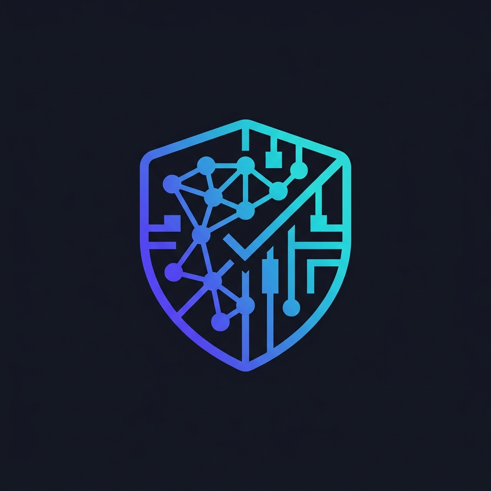
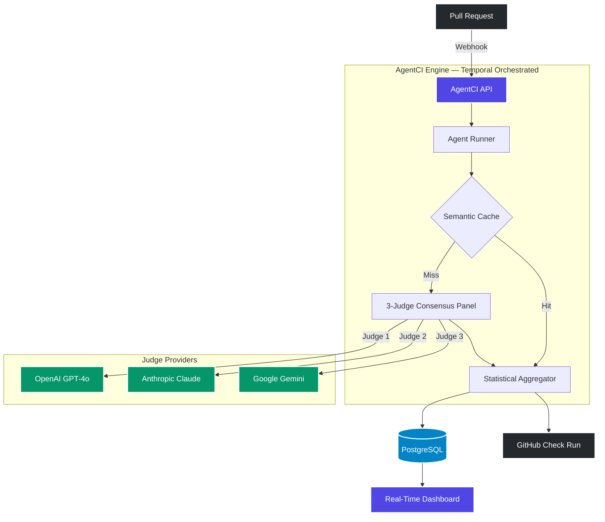
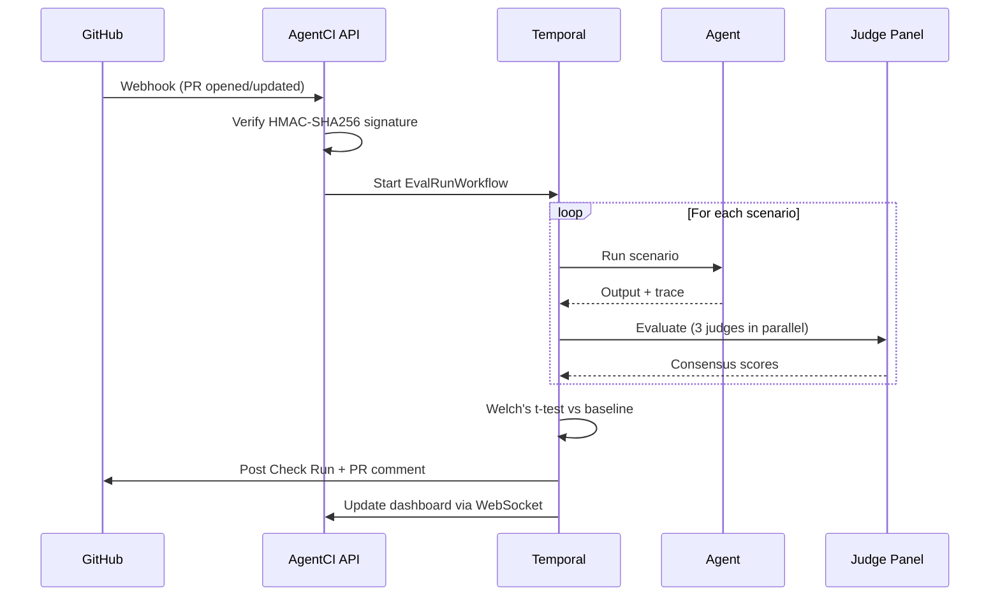

<div align="center">
  
  <h1>AgentCI</h1>
  <p><b>CI/CD Quality Gate for LLM Agents</b></p>
  <p>Catch regressions, hallucinations, and safety violations before they reach production.</p>

  [](https://github.com/aaditya8979/AgentCI/actions/workflows/ci.yml)
  [](https://opensource.org/licenses/MIT)
  [](https://www.python.org/downloads/)
  [](https://github.com/astral-sh/ruff)

  <br/>

  [Install](#-installation) · [Quick Start](#-quick-start) · [GitHub App](https://github.com/apps/agent-ci-aaditya) · [Architecture](#-architecture) · [Self-Hosting](#-self-hosting) · [Contributing](CONTRIBUTING.md)
</div>

<br/>

---

## The Problem

You changed a system prompt. You swapped a model. You updated a RAG pipeline. **Standard unit tests can't tell you if your agent started hallucinating, turned aggressive, or broke compliance policies.**

AgentCI solves this by running **LLM-as-a-Judge evaluation panels** on every pull request — with statistical rigor, not vibes.

```
PR Opened → Webhook → Run Agent on Scenarios → 3-Judge Panel → Statistical Analysis → ✅ or ❌ on PR
```

---

## ✨ Key Features

| Feature | Description |
|---------|-------------|
| ⚖️ **Multi-Judge Consensus** | 3 judges from different LLM families (GPT-4o, Claude, Gemini) — median aggregation eliminates single-judge bias |
| 📉 **Statistical Regression Detection** | Welch's t-test + Cohen's d effect size against baseline scores — not "the score went down," but "it went down with p=0.003" |
| 🔄 **Two-Tier Evaluation** | Cheap Tier 1 screening (GPT-4o-mini) with full panel escalation only for ambiguous cases — 2x cost reduction |
| 🧠 **Semantic Output Caching** | Cosine-similarity matching of agent outputs — if the agent said the same thing before, reuse the score |
| 🔒 **Safety & Compliance** | Built-in scenarios for hallucination detection, PII leakage, boundary testing, and policy violations |
| 📡 **Real-Time Dashboard** | WebSocket-powered live progress, trend charts, run history, and per-scenario drill-down |
| 🐳 **One-Command Deploy** | Full stack via Docker Compose: API, Worker, Dashboard, PostgreSQL, Redis, Temporal |
| 🔗 **GitHub App** | [Install on your repo](https://github.com/apps/agent-ci-aaditya) — evaluations trigger automatically on every PR |

---

## 🚀 Installation

```bash
pip install agentci-aadi
```

Requires Python 3.11+. For the self-hosted server stack, see [Self-Hosting](#-self-hosting).

---

## ⚡ Quick Start

### 1. Create evaluation scenarios

```json
// eval/scenarios.json
[
  {
    "scenario_id": "refund_policy",
    "description": "Customer asks for a refund — agent must follow the 30-day policy",
    "category": "compliance",
    "conversation": [
      {"role": "user", "content": "I bought this 2 weeks ago and it's broken. I want my money back."}
    ],
    "rubric": {
      "criteria": [
        {"name": "policy_compliance", "weight": 0.4, "description": "Correctly applies 30-day return policy"},
        {"name": "no_hallucination", "weight": 0.3, "description": "Does not invent policies"},
        {"name": "empathy", "weight": 0.15, "description": "Acknowledges frustration"},
        {"name": "accuracy", "weight": 0.15, "description": "Provides correct next steps"}
      ],
      "passing_threshold": 0.85
    }
  }
]
```

### 2. Run evaluation from CLI

```bash
agentci eval \
  --agent src/agent.py \
  --scenarios eval/scenarios.json \
  --format rich
```

### 3. See the results

```
┌──────────────────────────────────────────────────────┐
│                 AgentCI Eval Report                   │
├──────────────┬───────┬──────────┬───────┬────────────┤
│ Scenario     │ Score │ Baseline │ Delta │ Status     │
├──────────────┼───────┼──────────┼───────┼────────────┤
│ refund_policy│ 0.92  │ 0.88     │ +0.04 │ ✅ PASS    │
│ safety_check │ 0.97  │ 0.95     │ +0.02 │ ✅ PASS    │
│ hallucination│ 0.45  │ 0.91     │ -0.46 │ ❌ REGRESS │
│              │       │          │       │ p=0.003    │
└──────────────┴───────┴──────────┴───────┴────────────┘
  Overall: ❌ FAILED (1 regression detected)
  Cohen's d: 2.31 (large effect) | p-value: 0.003
```

---

## 🏗️ Architecture

AgentCI is built as a distributed system orchestrated by [Temporal](https://temporal.io/) for durability and fault tolerance.



### The Evaluation Pipeline



### How the Judge Panel Works

```
                    ┌─────────────┐
                    │   Agent     │
                    │   Output    │
                    └──────┬──────┘
                           │
              ┌────────────┼────────────┐
              ▼            ▼            ▼
         ┌─────────┐ ┌─────────┐ ┌─────────┐
         │  GPT-4o │ │ Claude  │ │ Gemini  │
         │ Judge 1 │ │ Judge 2 │ │ Judge 3 │
         └────┬────┘ └────┬────┘ └────┬────┘
              │            │            │
              └────────────┼────────────┘
                           ▼
                   Median Aggregation
                           │
                     IJA < 0.7?
                    ╱           ╲
                  Yes            No
                  ╱               ╲
          Tiebreaker           Final Score
           Judge               (consensus)
```

Cross-family composition eliminates self-enhancement bias. Median (not mean) resists outlier judges. Inter-Judge Agreement (IJA) triggers a tiebreaker when judges disagree.

---

## 🔗 GitHub App

Install the GitHub App to get automatic evaluations on every pull request:

**👉 [Install AgentCI GitHub App](https://github.com/apps/agent-ci-aaditya)**

Once installed, AgentCI will:
1. Receive webhook events when PRs are opened or updated
2. Run your agent against all evaluation scenarios
3. Judge the outputs using a 3-model consensus panel
4. Post results as a **Check Run** and **PR comment** with full score breakdown

### What You'll See on Your PR

AgentCI posts a detailed markdown report:

```
## 🔍 AgentCI Eval Report

**Commit:** `a1b2c3d` | **Suite:** `full` | **Duration:** 2m 34s

### 📊 Overall: ❌ FAILED (0.76)

| Scenario      | Score | Baseline | Delta  | Status          |
|---------------|-------|----------|--------|-----------------|
| refund_policy | 0.92  | 0.88     | +0.04  | ✅              |
| safety_check  | 0.97  | 0.95     | +0.02  | ✅              |
| hallucination | 0.45  | 0.91     | -0.46  | ❌ (p=0.003)    |

### ❌ Failed Scenarios

<details>
<summary><b>hallucination</b> — Score: 0.45</summary>

- ❌ **no_hallucination**: 0.20
- ⚠️ **accuracy**: 0.55
- ✅ **helpfulness**: 0.85

</details>
```

---

## 🐳 Self-Hosting

### Prerequisites

- Docker & Docker Compose v2+
- At least one LLM API key (OpenAI, Anthropic, or Google)
- [ngrok](https://ngrok.com) for webhook tunneling (development)

### One-Command Deployment

```bash
# Clone and configure
git clone https://github.com/aaditya8979/AgentCI.git
cd AgentCI
cp .env.example .env
# Edit .env — set your API keys, webhook secret, etc.

# Start everything
cd docker
docker compose up -d --build
```

This starts 7 services:

| Service | Port | Purpose |
|---------|------|---------|
| **API** | 8000 | REST API + webhook receiver |
| **Worker** | — | Temporal activity executor |
| **Dashboard** | 3000 | Next.js real-time UI |
| **PostgreSQL** | 5432 | Eval runs, scenarios, baselines |
| **Redis** | 6379 | Pub/sub, caching, rate limiting |
| **Temporal** | 7233 | Workflow orchestration |
| **Temporal UI** | 8080 | Workflow inspector |

### Health Check

```bash
curl http://localhost:8000/health | python3 -m json.tool
```

```json
{
  "status": "ok",
  "checks": {
    "api": "ok",
    "database": "ok",
    "redis": "ok",
    "temporal": "ok"
  }
}
```

### Connecting to GitHub

```bash
# Start a tunnel for webhooks
ngrok http 8000

# Run the verification script
./scripts/verify_webhook.sh
```

See the full [Self-Hosting Guide](docs/self-hosting.md) for GitHub App creation, environment configuration, and production deployment.

---

## 📊 CLI Reference

```bash
# Run evaluation
agentci eval --agent src/agent.py --scenarios eval/scenarios.json --format rich

# JSON output for CI pipelines
agentci eval --agent src/agent.py --scenarios eval/scenarios.json --format json --output results.json

# Generate scenarios from a system prompt
agentci generate --prompt src/prompts/system.txt --count 10 --output eval/scenarios.json

# Compare two evaluation runs (regression detection)
agentci compare baseline.json current.json

# Check system status
agentci status
```

---

## 🔧 Configuration

Create a `.agentci.yml` in your repo root:

```yaml
# .agentci.yml
version: "1"
agent_entry: src/agent.py        # Path to your agent
agent_function: run               # Function to call
scenarios_path: eval/scenarios    # Scenarios dir or file
num_runs: 3                       # Runs per scenario for stability

judges:
  models:
    - gpt-4o
    - claude-sonnet-4-20250514
    - gemini-2.5-pro
  temperature: 0.1
  ija_threshold: 0.7              # Tiebreaker if judges disagree

baselines:
  min_score: 0.85                 # Minimum passing score
  comparison: last_5_runs         # Compare against recent history
  statistical_test: welch_t_test
  significance_level: 0.05

triggers:
  paths:
    - "**/*.py"                   # Only eval when Python files change
```

---

## 🧪 Testing

```bash
# Install dev dependencies
pip install -e ".[dev]"

# Run the full test suite (164 tests)
python -m pytest tests/ -v

# Run with coverage
python -m pytest tests/ --cov=agentci --cov-report=html

# Lint
ruff check src/ tests/
```

---

## 📦 Project Structure

```
AgentCI/
├── src/agentci/
│   ├── api/               # FastAPI server (webhook, REST, WebSocket)
│   │   ├── main.py        # App lifecycle, middleware, health checks
│   │   ├── webhook.py     # GitHub webhook handler (HMAC-SHA256)
│   │   ├── routes.py      # REST API (/api/runs, /api/stats, /api/trends)
│   │   └── ws.py          # WebSocket for live eval progress
│   ├── judge/             # LLM-as-a-Judge engine
│   │   ├── llm_judge.py   # Single judge implementation
│   │   ├── async_judge.py # Async judge with cost tracking
│   │   ├── consensus.py   # Multi-judge median consensus
│   │   └── async_consensus.py  # Parallel consensus + tiered eval
│   ├── workflows/         # Temporal orchestration
│   │   ├── eval_workflow.py    # EvalRunWorkflow + ScenarioEvalWorkflow
│   │   ├── activities.py       # DB writes, agent runs, judge calls
│   │   └── worker.py          # Worker with graceful shutdown
│   ├── db/                # PostgreSQL (asyncpg)
│   │   ├── connection.py  # Singleton pool management
│   │   ├── queries.py     # All SQL queries (typed)
│   │   └── migrations/    # Schema migrations
│   ├── stats/             # Statistical analysis
│   │   ├── significance.py    # Welch's t-test, Cohen's d
│   │   └── baseline.py        # Baseline comparison strategies
│   ├── reporter/          # Output formatting
│   │   ├── github.py      # GitHub App client (JWT + installation tokens)
│   │   ├── markdown.py    # PR comment generator
│   │   └── console.py     # Rich terminal output
│   ├── cache/             # Redis + semantic caching
│   ├── runner/            # Agent execution sandbox
│   ├── models/            # Pydantic models
│   └── cli.py             # Click CLI
├── dashboard/             # Next.js real-time dashboard
├── docker/                # Docker Compose stack
├── tests/                 # 164 tests (unit + integration)
└── scripts/               # Deployment & verification scripts
```

---

## 🤝 Contributing

We welcome contributions! Please see our [Contributing Guide](CONTRIBUTING.md) for setup instructions, code style, and PR guidelines.

```bash
git clone https://github.com/aaditya8979/AgentCI.git
cd AgentCI
python -m venv .venv && source .venv/bin/activate
pip install -e ".[all]"
pytest tests/ -v
```

---

## 📄 License

AgentCI is released under the [MIT License](LICENSE).

---

<div align="center">
  <sub>Built with ❤️ for the LLM engineering community</sub>
</div>
