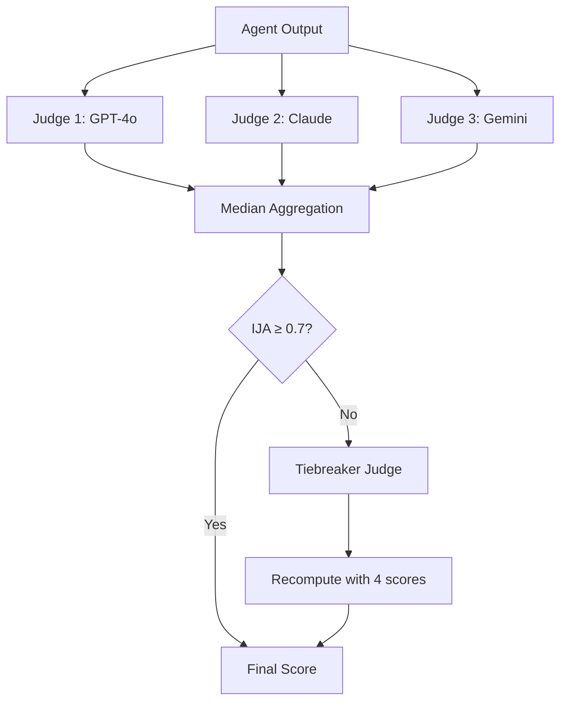

# Judge Panel

The judge panel is the core evaluation engine of AgentCI. It uses multiple LLMs from different families to evaluate agent outputs against rubric criteria.

## How It Works

## Consensus Algorithm

1. **Parallel execution** — All 3 judges evaluate simultaneously via `asyncio.gather()`
2. **Per-criterion scoring** — Each judge scores every rubric criterion independently (0.0–1.0)
3. **Median aggregation** — For each criterion, take the median of all judge scores
4. **Inter-Judge Agreement (IJA)** — Computed as `1 - (max_score - min_score)` per criterion
5. **Tiebreaker** — If overall IJA drops below threshold (default 0.7), a 4th judge is invoked
6. **Weighted final score** — Criterion medians are weighted according to the rubric

## Why Median Over Mean?

| Scenario | Judge 1 | Judge 2 | Judge 3 | Mean | Median |
|----------|---------|---------|---------|------|--------|
| Normal | 0.85 | 0.88 | 0.90 | 0.88 | 0.88 |
| One outlier | 0.20 | 0.88 | 0.90 | 0.66 | 0.88 |

Median is robust to a single outlier judge, which happens in practice when one model misinterprets the rubric.

## Two-Tier Evaluation

For cost reduction, AgentCI supports tiered evaluation:

- **Tier 1**: A single cheap model (GPT-4o-mini) screens each scenario
  - Score ≥ 0.95 → **Auto-pass** (skip full panel)
  - Score ≤ 0.30 → **Auto-fail** (skip full panel)
  - Score in between → **Escalate** to full 3-judge panel
- **Tier 2**: Full consensus panel for ambiguous cases

This typically reduces judge API costs by 40-60%.

## Cross-Family Composition

AgentCI uses judges from different LLM families to prevent self-enhancement bias:

| Family | Default Model | Role |
|--------|---------------|------|
| OpenAI | GPT-4o | Primary judge |
| Anthropic | Claude Sonnet | Secondary judge |
| Google | Gemini Pro | Tertiary judge |

Research shows that LLMs rate their own family's outputs higher. Cross-family panels produce more reliable evaluations.
