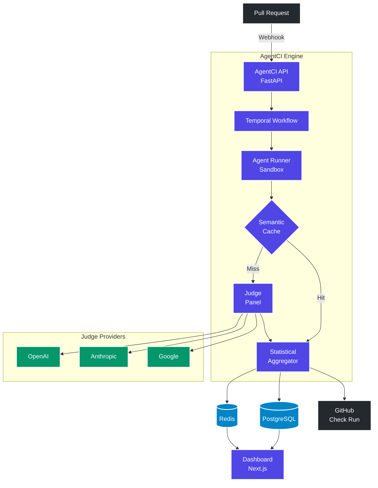

# Architecture Overview

AgentCI is a distributed system built on three core principles:

1. **Multi-model consensus** — No single LLM judges alone
2. **Statistical rigor** — Decisions based on p-values, not vibes
3. **Fault tolerance** — Temporal orchestration with automatic retries

## System Architecture

## Component Responsibilities

| Component | Technology | Responsibility |
|-----------|-----------|----------------|
| **API Server** | FastAPI + Uvicorn | Webhook receiver, REST API, WebSocket, auth |
| **Worker** | Temporal Worker | Executes eval workflows and activities |
| **Dashboard** | Next.js | Real-time UI for eval runs, trends, drill-downs |
| **PostgreSQL** | asyncpg | Eval runs, scenario results, baselines, audit log |
| **Redis** | redis-py | Pub/sub (live progress), rate limiting, caching |
| **Temporal** | temporalio | Workflow orchestration, retry logic, durability |

## Request Lifecycle

1. **Webhook received** — GitHub sends a `pull_request` event
2. **Signature verified** — HMAC-SHA256 against the shared secret
3. **Rate limit checked** — Sliding window counter in Redis
4. **DB row created** — Initial eval run record with status "pending"
5. **Temporal workflow started** — `EvalRunWorkflow` with run metadata
6. **Scenarios loaded** — From the repository's eval directory
7. **Agent executed** — Each scenario runs in a sandbox
8. **Judge panel evaluates** — 3 judges run in parallel via `asyncio.gather()`
9. **Consensus computed** — Median scores, IJA check, optional tiebreaker
10. **Baselines compared** — Welch's t-test against historical scores
11. **Results stored** — Scenario results, baselines, audit log
12. **GitHub updated** — Check run + PR comment with markdown report
13. **Dashboard notified** — WebSocket push via Redis pub/sub

## Key Design Decisions

### Why Temporal?

Eval workflows can take 5-30 minutes. If the worker crashes mid-evaluation, Temporal automatically resumes from the last completed activity. Each activity (run agent, call judge, write to DB) is independently retryable.

### Why Median Aggregation?

Mean is sensitive to outlier judges. If one judge gives 0.2 and two give 0.9, the mean is 0.67 (fail) but the median is 0.9 (pass). Median better represents the consensus.

### Why Cross-Family Judges?

LLMs from the same family (e.g., GPT-4o evaluating GPT-4o output) exhibit self-enhancement bias. Using judges from OpenAI, Anthropic, and Google ensures independent evaluation perspectives.
